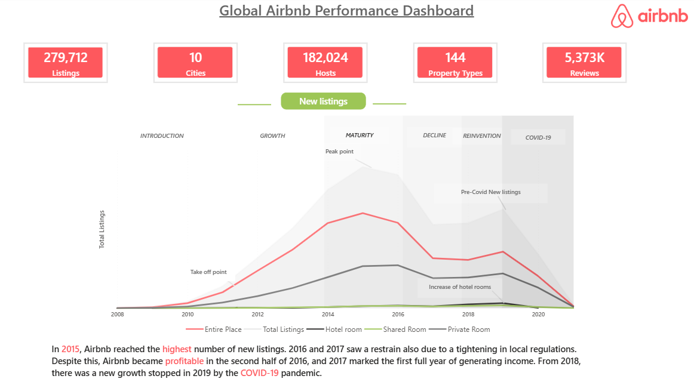
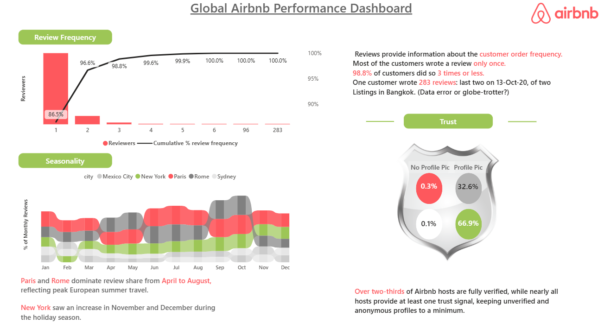

# Airbnb Global Performance Dashboard

# Project Overview

This project is an interactive Power BI dashboard created to analyze Airbnb performance across REVIEWS, RATINGS, SEASONALITY, and HOST TRUST.

The dashboard transforms Airbnb data into meaningful visual insights using Power BI and DAX.

# Objectives

- Analyze Airbnb review frequency and customer behavior
- Understand seasonal review patterns across different cities
- Analyze host verification and trust indicators
- Identify important trends in Airbnb reviews
- Present insights through an interactive Power BI dashboard

# Tools & Technologies

- Power BI
- DAX
- Microsoft Excel
- Data Visualization
- Data Analysis

# Dashboard Sections

# Review Frequency
Analyzes how frequently customers leave reviews and shows the cumulative percentage of reviewers.

# Seasonality
Shows monthly review patterns across cities including:
- Mexico City
- New York
- Paris
- Rome
- Sydney
- NOTE- Total number of Cities are 10 but these 5 cities are Top 5 cities where most reviews has registered.
# Trust
Analyzes host profile pictures and identity verification to understand trust signals among Airbnb hosts.

# Key Insights

- Most customers leave only one review.
- The cumulative percentage of reviewers increases rapidly after the first few review frequencies.
- Review activity varies across cities and months.
- Paris and Rome show strong seasonal review patterns.
- A large proportion of Airbnb hosts have verified identities or other trust signals.

#  Project Resources

This repository contains the supporting resources used to build the dashboard.

#  Skills Demonstrated

- Data cleaning and preparation
- Data analysis
- DAX calculations
- Interactive dashboard development
- Data visualization
- Business insight generation

# Conclusion

The Airbnb Global Performance Dashboard provides a visual overview of customer review behavior, seasonal trends, and host trust indicators. It demonstrates how Power BI and DAX can be used to convert raw data into actionable business insights.

## 📸 Dashboard Preview

### 1. Market Share by City

### 2. Ratings Analysis

### 3. Ratings Detailed Analysis

### 4. Reviews, Seasonality & Trust

